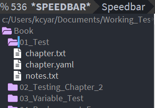

# Pretty Speedbar for Emacs



Why turn off the ugly Emacs Speedbar icons when you can replace them with pretty svg icons customized to match your theme?

## Installation

Pretty speedbar requires [f](https://github.com/rejeep/f.el), which installs via [Melpa](https://melpa.org/).

Download or clone `pretty-speedbar` and place it in the same directory as your init file or wherever you keep extensions.

Add the following to your init file.

```
;;;;;; Begin pretty-speedbar
(load "pretty-speedbar")

(setq pretty-speedbar-icon-size "20") ;; Icon width and height in pixels.
(setq pretty-speedbar-icon-fill "#FFFFFF") ;; Fill color for all non-folder icons.
(setq pretty-speedbar-icon-stroke "#DCDCDC") ;; Stroke color for all non-folder icons.
(setq pretty-speedbar-icon-folder-fill "#D9B3FF") ;; Fill color for all folder icons.
(setq pretty-speedbar-icon-folder-stroke "#CC00CC") ;; Stroke color for all folder icons.
```

Customize the values as desired. The above works well with the doom-one theme I'm currently addicted to.

If you want to take this a step further, customize your speedbar faces in your init file to match your icons.

```
;; Show unknown files and fix the indentation.
(setq speedbar-show-unknown-files t)
(setq speedbar-indentation-width 3)

;;; Customize text color
(custom-set-faces
'(speedbar-button-face ((t (:foreground "gray80"))))
'(speedbar-directory-face ((t (:foreground "gray60"))))
'(speedbar-file-face ((t (:foreground "gray80"))))
'(speedbar-highlight-face ((t (:background "slate blue" :foreground "gray98"))))
'(speedbar-selected-face ((t (:foreground "gray98" :underline t))))
'(speedbar-tag-face ((t (:foreground "gray80"))))
)
```

Once you have everything added to your init file, it's time to create the custom icons.

1. Open Emacs.
2. `M-x pretty-speedbar-generate` (If you're unfamiliar with Emacs, M-x is shorthand for Alt + x .)

Now, restart emacs and start using your pretty speedbar or sr-speedbar, which is my preference.
