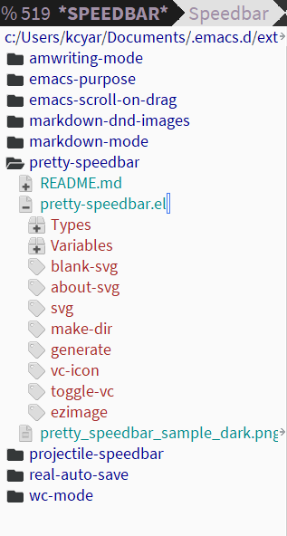
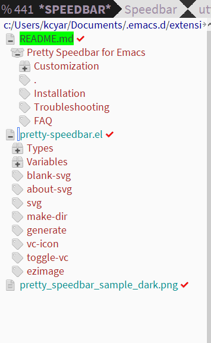

[](https://melpa.org/#/pretty-speedbar)

# Pretty Speedbar for Emacs


Why turn off the ugly Emacs Speedbar icons when you can replace them with pretty SVG icons customized to match your theme?

## Installation

Pretty Speedbar requires [Font Awesome's solid icon font](https://github.com/FortAwesome/Font-Awesome/tree/master/otfs). "Font Awesome 5 Free-Solid-900.otf" is the current version available from GitHub. Download and install this font. See [Customization](#customization) for details about using different icon sets.

To install, add melpa to your package sources.

### The MELPA Way

```lisp
(require 'package)
(add-to-list 'package-archives '("melpa" . "https://melpa.org/packages/"))
```
Then run:

```
M-x package-install RET pretty-speedbar RET
```
Add the following to your init file.

```lisp
;;;;;; Begin pretty-speedbar
(require 'pretty-speedbar)
```

### The Straight Way

```lisp
(straight-use-package 'pretty-speedbar)
```

### Creating Your First Icon Set

After saving your init file, create your icons.

1. Open Emacs.
2. `M-x pretty-speedbar-generate` (If you're unfamiliar with Emacs, M-x is shorthand for Alt + x .)

Now, restart Emacs, open a file, and run speedbar with `speedbar-toggle` or sr-speedbar with `sr-speedbar-open`. Your icons should be gray.

Now, restart Emacs and start using your pretty with either speedbar or sr-speedbar, which is my preference.

## Customization

There is no need to set `(setq speedbar-use-images t)` explicitly. If you've previously used speedbar, please search your init file for `speedbar-use-images` and delete this setting if it's nil. (I  don't set it in my init file at all. The default setting works fine for my purposes.)

### Icon Size

Changing the icon height alters the height and width of all icons, including checks and locks.

```lisp
(setq pretty-speedbar-icon-size 20) ;; Icon height in pixels.
```

### Icon Colors

By default, *Pretty Speedbar* creates a grayscale icon set, which is shown below in `doom-one-light`. Directories that include read-only files will display a red lock icon to their right. The default setting is legible but not beautiful. Customize the color scheme to suit your theme and then `M-x pretty-speedbar-generate` to create your icons. You can also customize individual icons to use the folder color scheme.

|  |  |


```lisp
(setq pretty-speedbar-icon-fill "#FFFFFF") ;; Fill color for all non-folder icons.
(setq pretty-speedbar-icon-stroke "#DCDCDC") ;; Stroke color for all non-folder icons.
(setq pretty-speedbar-icon-folder-fill "#D9B3FF") ;; Fill color for all folder icons.
(setq pretty-speedbar-icon-folder-stroke "#CC00CC") ;; Stroke color for all folder icons.
(setq pretty-speedbar-about-fill "#EFEFEF") ;; Fill color for all icons placed to the right of the file name, including checks and locks.
(setq pretty-speedbar-about-stroke "#DCDCDC") ;; Stroke color for all icons placed to the right of the file name, including checks and locks.
(setq pretty-speedbar-signs-fill "#594968") ;; Fill color for plus and minus signs used on non-folder icons.
```

Customize the values as desired. The above works well with the doom-one theme I'm currently addicted to.

### Extra Speedbar Settings

Here are some optional speedbar settings drawn from my init file. Indentation and markdown header support are by far the most useful. I typically do not want hidden directories visible inside speedbar. If you desire that, see [wagnermarques' comment on StackOverflow](https://stackoverflow.com/questions/2220005/how-do-i-enable-speedbar-to-display-all-types-of-files).

```
;; Increase the indentation for better useability.
(setq speedbar-indentation-width 3)
;; Add Markdown Header support
(speedbar-add-supported-extension ".md")
;; Disable checkmarks
(setq speedbar-vc-do-check nil)
(add-hook 'speedbar-mode-hook (lambda()
  ;; Disable word wrapping in speedbar if you always enable it globally.
  (visual-line-mode 0) 
  ;; Change speedbar's text size.  May need to alter the icon size if you change size.
  (text-scale-adjust -1)
))
```

### Style Speedbar Text

If you want to take this a step further, customize your speedbar faces in your init file to match your icons.

```
;;; Customize text color
(custom-set-faces
'(speedbar-button-face ((t (:foreground "gray80"))))
'(speedbar-directory-face ((t (:foreground "gray60"))))
'(speedbar-file-face ((t (:foreground "gray80"))))
'(speedbar-highlight-face ((t (:background "slate blue" :foreground "gray98"))))
'(speedbar-selected-face ((t (:foreground "gray98" :underline t))))
'(speedbar-tag-face ((t (:foreground "gray80"))))
)
```

Please note that you can only have one custom-set-faces. This will include all of your faces customizations, not just speedbar. For example, mine tweaks criticmarkup-emacs' highlights face before speedbar.

Before you cut and paste this entire snippet, search your init file for *custom-set-faces*. If it exists, copy the lines containing `speedbar-` and paste them into your *custom-set-faces* instead.

### Customizing the Icons

#### Set an Icon Font

Add the following to your init file and change `Font Awesome 5 Free Solid` to your alternative icon font's name.

```
(setq pretty-speedbar-font "Font Awesome 5 Free Solid")
```

Please note that changing the icon font requires changing all of the icon variables, which are listed in the icon reference below.

#### Icon Reference

##### File Tree Icons

Let's assume I dislike the rectangular plus and minus page icons and want to swap them out with a square sticky note icon. According to the table below, this icon uses the variable `pretty-speedbar-blank-page`. The unicode for [Font Awesome's sticky-note](https://fontawesome.com/v5.15/icons/sticky-note?style=solid) is `f249`. In Emacs, unicode characters are prefaced with `\u`. This gives me the following setting.

```
(setq pretty-speedbar-blank-page '("\uf249" nil))
```

Changing `nil` to `t` swaps the icon's color scheme to the folder settings.

To see these changes, run `M-x pretty-speedbar-generate`.

| Variable | Description | Default Unicode | Is Folder | Created Image |
|:--|:--|:--|:--|:--|
| pretty-speedbar-folder | Closed folder icon. | "\uf07b" | t |  |
| pretty-speedbar-folder-open | Open folder icon. | "\uf07c" | t |  |
| pretty-speedbar-blank-page | Used for plus and minus file icons. | "\uf15b" | nil |  ->  and  |
| pretty-speedbar-page | Default file icon. | "\uf15c" | nil |  |
| pretty-speedbar-box-closed | Closed box icon with plus added during generation. | "\uf466" | nil |  ->  |
| pretty-speedbar-box-open | Open box icon with minus added during generation. | "\uf49e" | nil |  ->  |
| pretty-speedbar-book | Book icon used for documentation available. | "\uf02d" | nil |  |
| pretty-speedbar-mail | Envelope icon. | "\uf0e0" | nil |  |
| pretty-speedbar-info | Info icon. | "\uf05a" | nil |  |
| pretty-speedbar-tags | Tags icon used for plus and minus tags generation. | "\uf02c" | nil |  ->  and  |
| pretty-speedbar-tag | Single tag icon. Most frequent tag icon. | "\uf02b" | nil |  |

##### Right Icons

Simply change the unicode to your liking and enter it as follows.

```
(setq pretty-speedbar-check '("\uf00c"))
```

| Variable  |  Default Unicode | Created Image |
|:--|:--|:--|
| pretty-speedbar-lock  | `"\uf023"` |  |
| pretty-speedbar-check | `"\uf00c"` |  |

## Troubleshooting

1. Open one of the generated SVG icons in your web browser, not Emacs. Do you see an icon? If not, your font name may be incorrect. To correct the font name, go to your installed fonts and search for Font Awesome (or your preferred icon font). Double check that the name in your installed fonts matches your `(setq pretty-speedbar-font...)` setting. Don't forget that you can always edit the font name in one of your svg files by hand and reload it in the browser to quickly verify the font name.
2. If you see the generated SVG icon in your web browser, open the SVG in Emacs. Do you see an image? If not, your Emacs may not have SVG support enabled. In which case, this method will not work for your installation.
3. If you can see the SVG image in Emacs but not in speedbar, please open a GitHub issue.

## FAQ

* Why does this save icon files?
  * Speedbar uses defezimage, a defimage macro, for its images. This requires either a `:file` or a `:data` property for each image. However, `:data` caused massive performance issues during testing with a single icon. It's also less flexible, meaning it doesn't easy customization with a program like Inkscape.
* Does this download anything?
  * No. This does not and will not download files.
* Can I create my own images without running `pretty-speedbar-generate`?
  * Certainly! Create the *pretty-speedbar-icons* directory in the same folder as your init file. Then add your SVG files manually using the same names as the generator. You can find the required filenames in the .el file under the `pretty-speedbar-generate` function. Just look for `"pretty-..."` and add `.svg` to the end. Don't forget to resize the height and width, not the viewbox, and add fill and stroke colors.
* Can I edit my icons?
  * All svg icons are editable. To edit an svg in Inkscape, make your changes and then save it with the original filename as an optimized svg.
* How do I start speedbar?
  * Open a file in Emacs. Then `M-x speedbar`. For sr-speedbar, which opens in a frame instead of a separate window, install it from Melpa and run `M-x sr-speedbar-open`.
